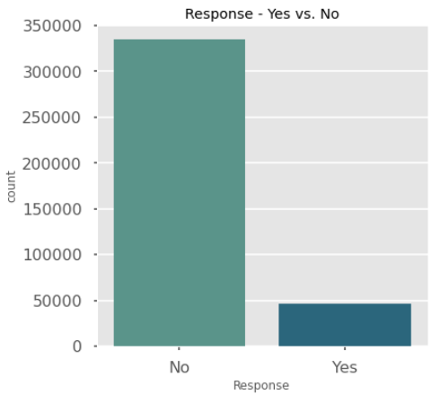
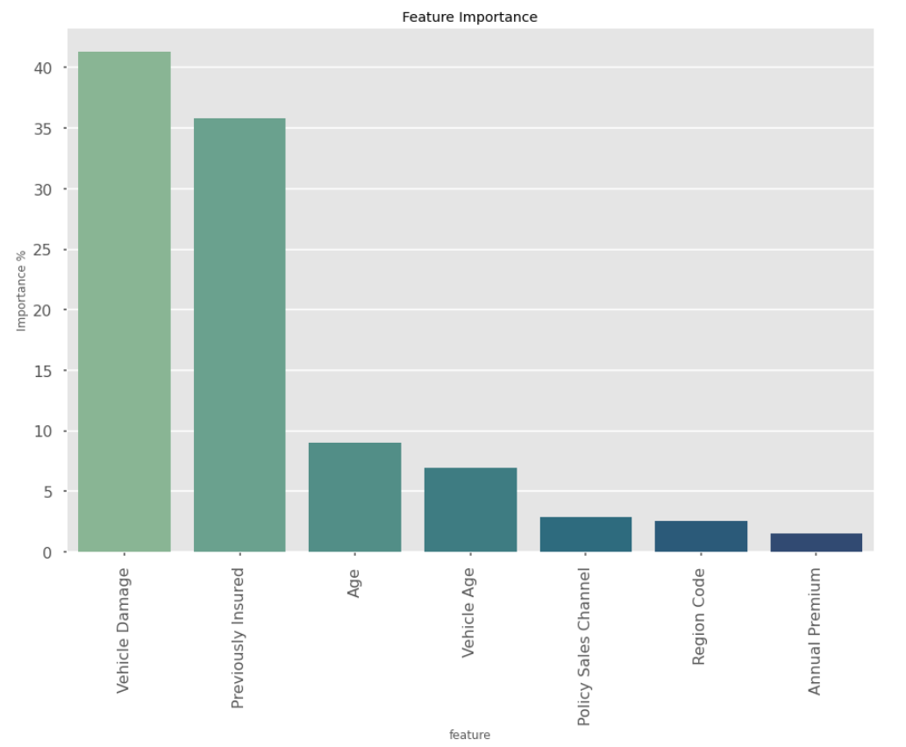
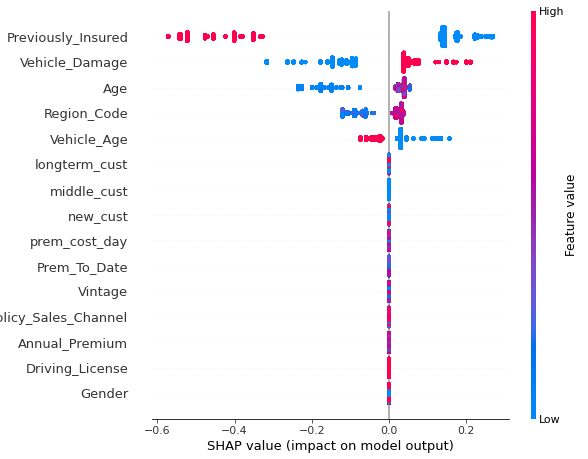
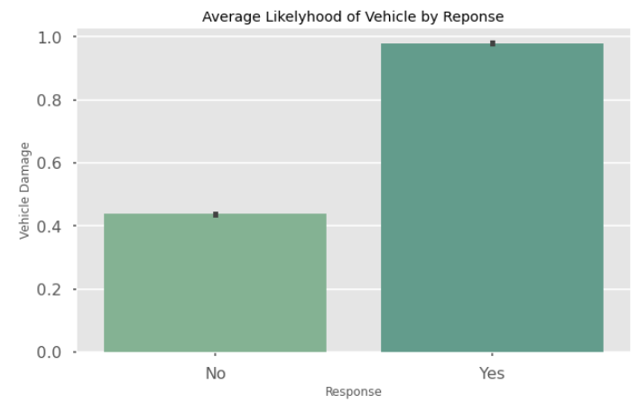

# Auto Insurance Cross-Sell

## Business Case

# Business Case 

[Kaggle Dataset](https://www.kaggle.com/anmolkumar/health-insurance-cross-sell-prediction)

Our client is an Insurance company that has provided Health Insurance to its customers now they need your help in building a model to predict whether the policyholders (customers) from past year will also be interested in Vehicle Insurance provided by the company.

An insurance policy is an arrangement by which a company undertakes to provide a guarantee of compensation for specified loss, damage, illness, or death in return for the payment of a specified premium. A premium is a sum of money that the customer needs to pay regularly to an insurance company for this guarantee.

For example, you may pay a premium of Rs. 5000 each year for a health insurance cover of Rs. 200,000/- so that if, God forbid, you fall ill and need to be hospitalised in that year, the insurance provider company will bear the cost of hospitalisation etc. for upto Rs. 200,000. Now if you are wondering how can company bear such high hospitalisation cost when it charges a premium of only Rs. 5000/-, that is where the concept of probabilities comes in picture. For example, like you, there may be 100 customers who would be paying a premium of Rs. 5000 every year, but only a few of them (say 2-3) would get hospitalised that year and not everyone. This way everyone shares the risk of everyone else.

Just like medical insurance, there is vehicle insurance where every year customer needs to pay a premium of certain amount to insurance provider company so that in case of unfortunate accident by the vehicle, the insurance provider company will provide a compensation (called ‘sum assured’) to the customer.

Building a model to predict whether a customer would be interested in Vehicle Insurance is extremely helpful for the company because it can then accordingly plan its communication strategy to reach out to those customers and optimise its business model and revenue.

Now, in order to predict, whether the customer would be interested in Vehicle insurance, you have information about demographics (gender, age, region code type), Vehicles (Vehicle Age, Damage), Policy (Premium, sourcing channel) etc.

## Data

The dataset directly from Kaggle is very clean, and this is not really the challenge of the data. The true challenge ended up being the heavy class imbalance, with the target class being ~13% of total `Reponses`.

Another challenge that was found within the datset was the lack of overall features. There were several categorical features that made it difficult to derive a lot of new meaningful features from. We made an attempt to derive new features, but in the end the feature importance of the modeling ruled them moot.

## EDA 

The first major data point is the `Response` target feature. What we see is the major class imbalance between the yes and no responses to the cross-sell attempt. So it is important to look for information like this, as things such as class imbalance are major issues during modeling.

This `countplot` shows the heavy imbalance within the classes. Our target class being the minority. This tells us that we need to work on class balancing to assist our models later on.

The next two plots were two that involved the important features that we found after modeling.

These plots back up our conclusion post-modeling.

## Train-Test Split

Train-test splitting your dataset is valuable, as it is important that your test data hasn't been seen by the model. Models work to generalize well on data that it has seen and learned, but in order to validate you need a testing (or validation) set to make sure that the model generalized enough and neither overfitted or underfitted.

**Overfitting** and **Underfitting** are both plagues to Machine Learning. 

* **Overfitting** means the model has learned the patterns and noise in the training data so well that it can't generalize to any unseen data.

* **Underfitting** is when a model can neither generalize to the training data nor to the new data.

As stated above a train-test split allows us to test for these conditions of the data.

## Class Imbalance 

The first major issue that we are running into is the major class imbalance between our two dependent classes. This will produce a model with a high accuracy but will be a failure in generalizing for the minority class. In this problem we are looking to find the minority class. 

Classification via Machine Learning is based upon the assumption of roughly balanced classes. This provides an interesting landscape for problems to arise because in many real datasets the classes can be anywhere from roughly balanced, to slightly imbalanced, to severely imbalanced. Therefore, as data scientists must find methods to satisfy the assumption of rough balance between predictive classes. 

Classically, there are several methods of class balancing that data science pioneers have developed. The major methods are **Oversampling**, **Undersampling**, **Synthetic Sampling**, and **Penalization**. 

* **Oversampling -** this method takes the minority sample and draws more samples from it at random.
* **Undersampling -** this method randomly draws less samples from the majority class.
* **Synthetic Sampling -** this method creates random samples based off of the provided training data.
* **Penalization -** this method will increase the cost of a decision for an algorithm making the decision towards the majority class, therefore making it more likely that the algorithm will select the minority class.

In 2011 a paper was written that broke new ground in class balancing methods. It introduced **Synthetic Minority Oversampling Technique** or **SMOTE** for short. SMOTE functions through synthetic sampling and oversampling to produce samples that balance the classes. 

> … SMOTE first selects a minority class instance a at random and finds its k nearest minority class neighbors. The synthetic instance is then created by choosing one of the k nearest neighbors b at random and connecting a and b to form a line segment in the feature space. The synthetic instances are generated as a convex combination of the two chosen instances a and b.

> — Page 47, Imbalanced Learning: Foundations, Algorithms, and Applications, 2013.

SMOTE is evaluated using the area under the Receiver Operating Characteristic curve (AUC) and the ROC convex hull strategy. 

ROC Convex can be explined intuitively [here](https://stats.stackexchange.com/questions/120361/what-is-the-convex-hull-in-roc-curve) with this image: 

We have chose to use the SMOTE method for class balancing in our model for these reasons.

## Modeling
### Decision Tree

Decision trees are a method of supervised learning that takes data and provides predictions by learning simple rules that are inferred from the data. Decision trees learn from data to approximate a sine curve with a set of if-then-else decision rules. Deeper trees mean more complex decisions and a more fit model.

Decision Trees are simple and function for both numeric and categoric data. It is very interpretable and the data doesn't require much preparation before modeling. The model is fairly robust against violation of core assumptions.

Unfortunately, Decision Trees have several downsides as well. Decision trees are prone to overfitting to your data unless pruning and depth management techniques are use. Small variations in the data can grow wildly different trees. Data balance can create heavily biased trees, therefore it is required to balance classes.

### Random Forest Classifier

Random Forests are an ensemble method of supervised learning that averages a group of trees grown from slightly different parameters. These parameters are randomized so that each tree is slightly different. Each sample for the tree is drawn with replacement from a training set. The `max_features` parameter is also randomized and best splits are found from all inputs or a random selection of size according to your `max_features`. These two injections of randomness combine to make the model resilient against prediction error, as some error cancel out. Random Forest reduce variance and thus overall generally produce a better model than single grown trees.

### K-Nearest Neighbors Classified

Nearest neighbors classification is a form of instance based or non-generalizing learning. It does not attempt to construct a model, but instead stores a full dataset. The model is then constructed from a simple majority vote of the nearest neighbors. The data class is assigned by the most representative points of the nearest neighbors.

### XGBoost Classifier

XGBoost, or Extreme Gradient Boosting, is a library package for machine learning that was developed by Tianqi Chen as a research project.

>"The name xgboost, though, actually refers to the engineering goal to push the limit of computations resources for boosted tree algorithms. Which is the reason why many people use xgboost."
— **Tianqi Chen**

XGboost was developed in C++, but was later deployed in Python, R, Julia, and Java. 

The library supports many features from Sci-kit Learn with new additions. The three main forms of gradient boosting supported by the packages are: 
*  **Gradient Boosting**
*  **Stochastic Gradient Boosting**
*  **Regularized Gradient Boosting**

These are, however not the main goal of the project as stated by Chen in the above quote. The system features are the real spot light for XGBoost. The system features are:

*  Parallelization of tree construction using all of your CPU cores during training.
*  Distributed Computing for training very large models using a cluster of machines.
*  Out-of-Core Computing for very large datasets that don’t fit into memory.
*  Cache Optimization of data structures and algorithm to make best use of hardware.

Finally the package was developed with some algorithmic considerations in mind:
*  Sparse Aware with automatic handing of missing data values
*  Block structure to support parallelization of tree growing
*  Continued Training so that a fitted model may be further boosted on new data.

These all combine into the major features of the library:
*  Speed
*  Model Performance

All of these features make for a robust ecosystem in which to grow and build gradient boosted trees.

### CatBoost

The goal of training is to select the model , depending on a set of features , that best solves the given problem (regression, classification, or multiclassification) for any input object. This model is found by using a training dataset, which is a set of objects with known features and label values. Accuracy is checked on the validation dataset, which has data in the same format as in the training dataset, but it is only used for evaluating the quality of training (it is not used for training).

CatBoost is based on gradient boosted decision trees. During training, a set of decision trees is built consecutively. Each successive tree is built with reduced loss compared to the previous trees.

[CatBoost](https://catboost.ai/docs/concepts/algorithm-main-stages.html)

## Best Model Evaluation

After our modeling process we have found that CatBoost was able to produce the best model as based on the `Recall` metric. Recall is metric we have chosen. Looking to our business case it is more important to locate the most `True Positives` with allowing some negatives to slip in as it would be to wrongly classify something an allow a potential sale to slip by.  

### Feature Importance

### SHAP Explainer 

SHAP Values. 

> SHAP values are based on Shapley values, a concept coming from game theory. But game theory needs at least two things: a game and some players. How does this apply to machine learning explainability? Imagine that we have a predictive model, then:

> * the “game” is reproducing the outcome of the model,
> * the “players” are the features included in the model.

>What Shapley does is quantifying the contribution that each player brings to the game. What SHAP does is quantifying the contribution that each feature brings to the prediction made by the model. 

>It is important to stress that what we called a “game” concerns a single observation. One game: one observation. Indeed, SHAP is about local interpretability of a predictive model.

[SHAP values explained exactly how you wished someone explained to you - Towards Data Science](https://towardsdatascience.com/shap-explained-the-way-i-wish-someone-explained-it-to-me-ab81cc69ef30)

## Important Take-Aways

The most important take aways from the feature importance section of our model is that:
*  **It is important to only target those individuals without Vehicle insurance.**
*  **Customers with previous vehicle damage are more likely to agree to the cross sale.**
* **Younger people are less likely to purchase the cross-sell**

### Recommendations

Finally we have worked our way through data retrieval, analysis, and modeling and we have discovered that there are some very important factors influencing the prediction of cross-selling.
1. Does the individual already have auto insurance?
2. Does the individual have any previous auto damage?
3. What is the age group the individual falls into?

From this we drew a few further insights:
* Cross-sell interest is generally Male.
* Those interested have had a health insurance policy less time.

These points could be used to draw from further pools of client and narrow the search.